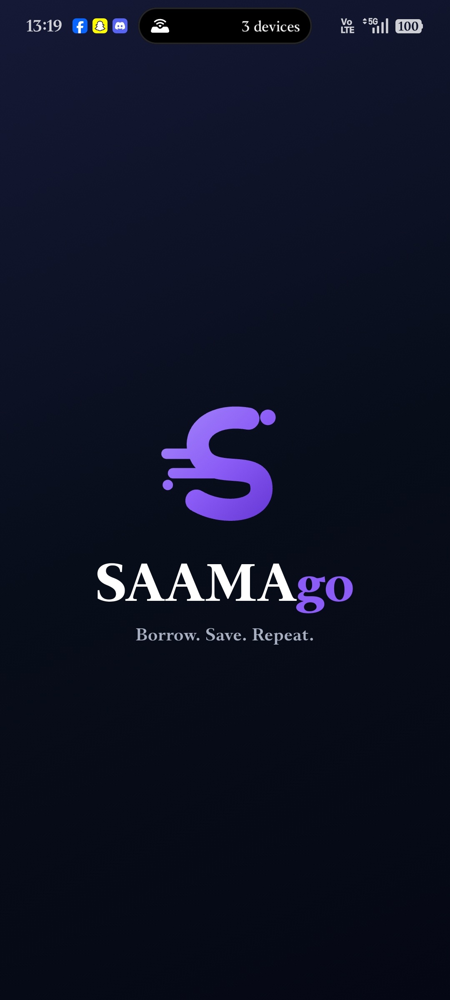
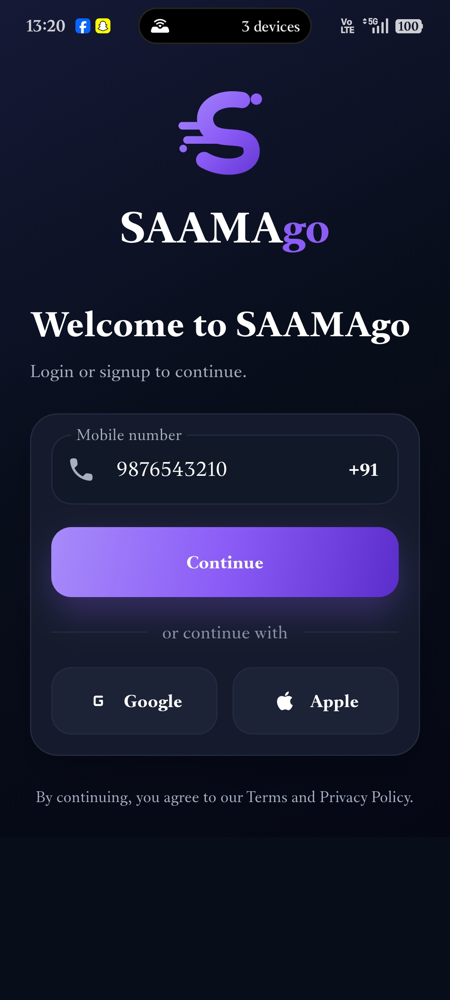
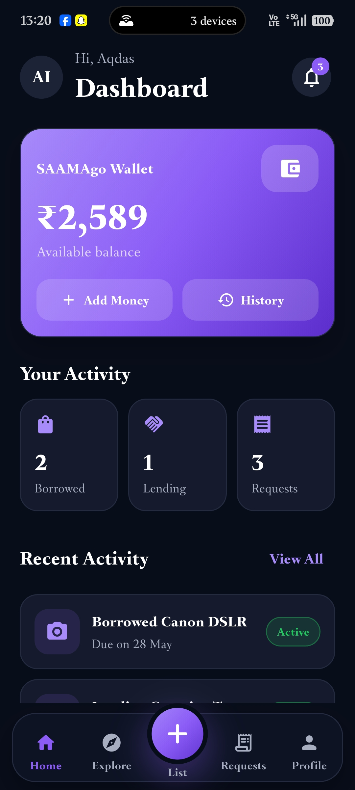
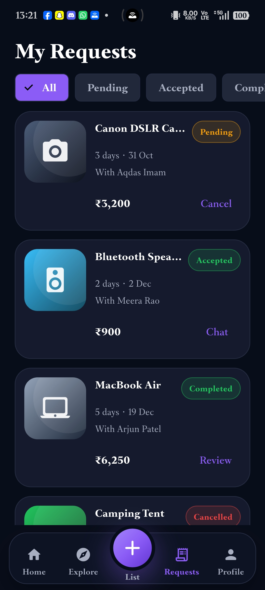
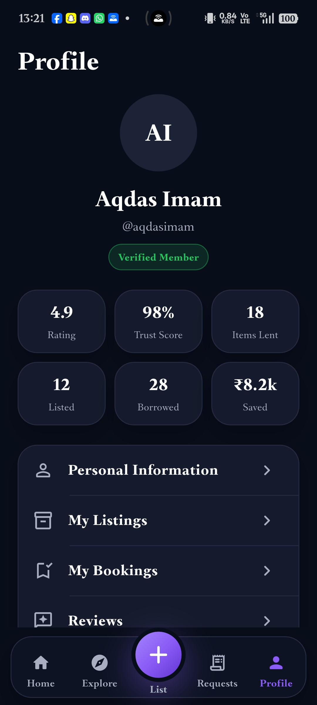

# SAAMAgo

Borrow. Save. Repeat.

SAAMAgo is a polished mobile-first borrowing and lending marketplace frontend. It demonstrates how people can discover nearby items, borrow them for a short duration, list unused items, manage requests, chat with owners, track wallet activity, and build trust through reviews and profile signals.

## Main Features

- Premium dark Material 3 UI with purple gradient cards, rounded controls, soft borders, and compact dashboard layouts.
- Reusable SAAMAgo monogram and wordmark built with Flutter widgets and CustomPainter.
- Phone-first login, six-digit OTP verification, and mock location permission flow.
- Persistent five-tab bottom navigation: Home, Explore, List Item, Requests, and Profile.
- Local mock marketplace data for electronics, books, sports gear, tools, events, furniture, gaming, and music.
- Item search, category chips, favourites, filters, sorting, list/grid switching, and a mock map view.
- Item details with owner trust score, pricing, deposit, availability, condition, safety information, chat, and borrow actions.
- Borrow confirmation with duration controls, pickup/delivery choice, fee calculation, mocked payment, and pending request creation.
- Requests tabs for All, Pending, Accepted, Completed, and Cancelled states.
- Local chat message sending, notifications read state, wallet transactions, listing form, reviews, referrals, settings, and help support.

## Implemented Screens

Splash, Onboarding 1-3, Login / Signup, OTP Verification, Location Permission, Main Dashboard, Explore, Item Details, Borrow Confirmation, My Requests, Chat, Wallet, List Your Item, Notifications, Profile, Settings, Filter and Sort, Map View, Reviews, Refer and Earn, Help and Support, and reusable empty/loading states.

## Design System

The app uses a centralized dark design system:

- Main background: `#080D1A`
- Secondary background: `#0D1323`
- Card surface: `#151B2C`
- Elevated card: `#1C2337`
- Primary purple: `#8B5CF6`
- Light purple: `#A78BFA`
- Dark purple: `#5B2DCB`
- Primary text: `#FFFFFF`
- Secondary text: `#A8AFC0`
- Success: `#22C55E`
- Warning: `#F59E0B`
- Error: `#EF4444`

## Project Structure

```text
lib/
  main.dart
  app/
  core/
    constants/
    theme/
    utils/
    widgets/
  data/
  models/
  screens/
```

## Setup

```bash
flutter clean
flutter pub get
dart format .
flutter analyze
flutter test
flutter run
```

## Demo Credentials

Mock OTP: `123456`

## Frontend Demo Limitations

Authentication, OTP delivery, wallet balance, payments, location permission, maps, chat, notifications, reviews, and item publishing are all mocked locally. No backend, payment gateway, paid maps API, Firebase, Supabase, or secret credentials are required.

Native package identifiers were intentionally left unchanged to avoid risky application-ID or bundle-ID changes. Rename them as a future release task when production signing, store listings, and migrations are planned.

## Future Backend Roadmap

- Add a real backend using Firebase or Supabase.
- Add production authentication and identity verification.
- Integrate a real payment provider and deposit escrow flow.
- Replace mock chat with real-time messaging.
- Add real maps, geocoding, and location-based availability.
- Add disputes, refunds, return evidence, and support workflows.
- Add QR-based handover and return confirmation.
- Persist favourites, listings, wallet events, notifications, and onboarding completion.


## Screenshots

### Splash Screen


### Login Screen


### Home Dashboard


### Explore Screen


### Profile Screen



## Demo

Coming soon: SAAMAgo app walkthrough video.


## Project Status

🚧 Currently a frontend prototype with mocked local data.

Future improvements:

- Backend integration
- Real authentication
- Payment integration
- Real-time chat
- Cloud database
- Location-based item discovery


## Features

- User onboarding and authentication flow
- Item discovery and search
- Borrow and lending workflow
- Item listing system
- Request management
- User profile and reviews
- Modern dark-themed UI


## Tech Stack

- Flutter
- Dart
- Material 3
- Android SDK
- Responsive UI Design
- Local Mock Data Management
- Git & GitHub


## Author

**Syed Aqdas Imam**

Computer Science & Engineering Student

GitHub: https://github.com/syedaqdas